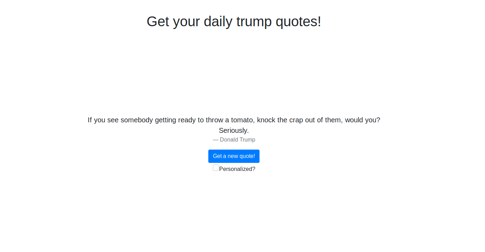
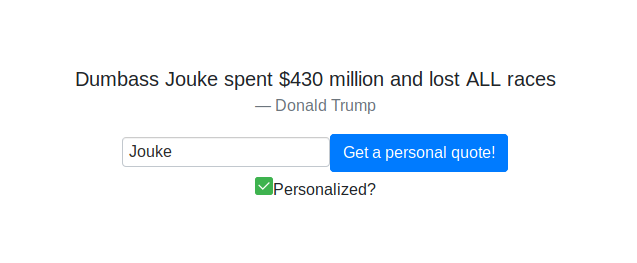

# Trump Says
Get a random trump quote!

[demo here!](https://jprofijt.github.io/trump-says/)

* Get a new trump quote each time you press the button



* Remembers history of previous generated quotes


* If you enter your name you can even get personalized quotes, directed at you.


## Project setup
```
git clone https://github.com/CxJuke/trump-says.git
cd trump-says
npm install
```

### Compiles and hot-reloads for development
```
npm run serve
```

### Compiles and minifies for production
```
npm run build
```


### Lints and fixes files
```
npm run lint
```

### Customize configuration
See [Configuration Reference](https://cli.vuejs.org/config/).
